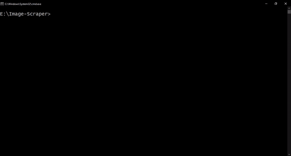

# Image-Scraper

The best source of images is the internet but downloading them individually is a herculean task and hence must be automated using a program. Image-Scraper is a python program that can be used to download images from the web for training deep learning models.



## Salient features
- Images are searched on the web using the following search engines: Google, Bing, Yahoo and DuckDuckGo
- A file containing a list of keywords can be passed to the program when multiple keywords need to be scraped
- Images from a custom URL can be scraped
- A new directory is created for every keyword
- A prefix and/or a suffix can be added to all the keywords passed to the program via a file
- Duplicate images are found by comparison of SHA-256 hash and then removed
- Similar images are found using perceptual hashing and then removed


## How to use the tool?
1. Download the repository
2. Install Google Chrome Version 94 or download the updated chrome driver from https://chromedriver.chromium.org/downloads and replace the chrome driver in the ‘chrome-driver’ directory
3. Install the required modules 
``` 
pip install -r requirements.txt
```
4. Open command prompt or terminal and move to the directory where the script is present. Run the script
```
cd path/to/directory
python imscraper.py [-h] (-k K | -f F | -c C) [-se SE] [-n N] [-p P] [-s S] [-st ST] [-o O]
```

### Arguments
```text
usage: imscraper.py [-h] (-k K | -f F | -c C) [-se SE] [-n N] [-p P] [-s S] [-st ST] [-o O]

-h, --help  Shows the help message with usage and arguments
-k K        Keyword to search on the search engine
-f F        File with list of keywords. Use a file option instead of the keyword option when you want to download images for multiple keywords. Each keyword must be on a new line.
-c C        Scrape images from the specified custom URL [Experimental]
-se SE      Search engine to use for finding the images on the web. This argument can have any one of the following values: google, bing, yahoo, duckduckgo or all. All search engines supported by the program are used by default.
-n N        Number of images per keyword. Limit the number of images per keyword. The default limit is all images.
-p P        Add a prefix to the keyword
-s S        Add a suffix to the keyword
-st ST      Similarity threshold for removing perceptually similar images. The default value for this threshold is 98 per cent.
-o O        Output directory for the scraped images. Each keyword gets its own directory. The default output directory is in the same directory in which the script is present.
```


## Run the scraper on the cloud
1. Download notebook.ipynb
2. Upload to Google Colab or Kaggle
3. Make appropriate changes as per instructions and run the notebook

### Disclaimer
It is advised to use this image scraper for academic or research purposes only.


Under no circumstances will the creator/s of this application be held responsible or liable in any way for any claims, damages, losses, expenses, costs or liabilities whatsoever (including, without limitation, any direct or indirect damages for loss of profits, business interruption or loss of information) resulting or arising directly or indirectly from your use of or inability to use this application even if the creator/s of this application have been advised of the possibility of such damages in advance.

### Made with lots of ⏱️, 📚 and ☕ by InputBlackBoxOutput
